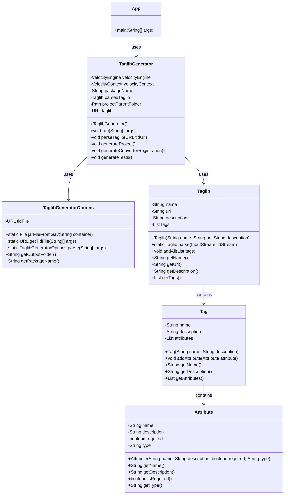
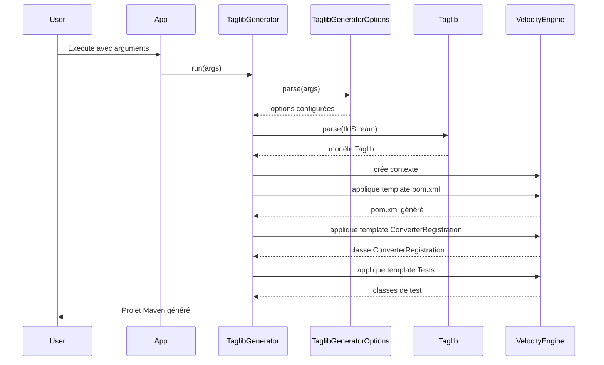
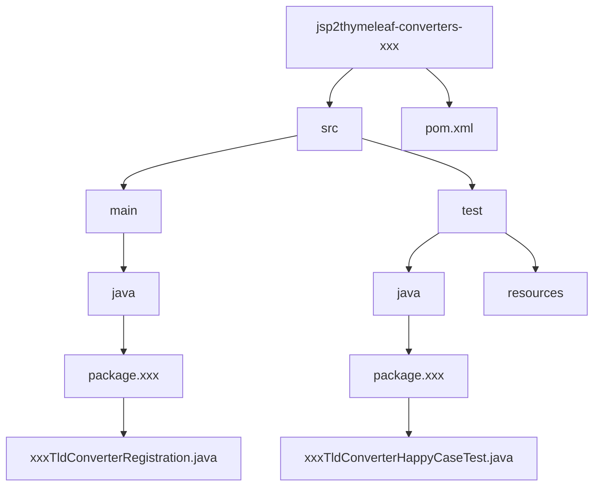

# Diagramme d'Architecture du Module jsp2thymeleaf-tldgen

```mermaid
classDiagram
    class App {
        +main(String[] args)
    }
    
    class TaglibGenerator {
        -VelocityEngine velocityEngine
        -VelocityContext velocityContext
        -String packageName
        -Taglib parsedTaglib
        -Path projectParentFolder
        -URL taglib
        +TaglibGenerator()
        +void run(String[] args)
        -void parseTaglib(URL tldUrl)
        -void generateProject()
        -void generateConverterRegistration()
        -void generateTests()
    }
    
    class TaglibGeneratorOptions {
        -URL tldFile
        +static File jarFileFromGav(String container)
        +static URL getTldFile(String[] args)
        +static TaglibGeneratorOptions parse(String[] args)
        +String getOutputFolder()
        +String getPackageName()
    }
    
    class Taglib {
        -String name
        -String uri
        -String description
        -List<Tag> tags
        +Taglib(String name, String uri, String description)
        +static Taglib parse(InputStream tldStream)
        +void addAll(List<Tag> tags)
        +String getName()
        +String getUri()
        +String getDescription()
        +List<Tag> getTags()
    }
    
    class Tag {
        -String name
        -String description
        -List<Attribute> attributes
        +Tag(String name, String description)
        +void addAttribute(Attribute attribute)
        +String getName()
        +String getDescription()
        +List<Attribute> getAttributes()
    }
    
    class Attribute {
        -String name
        -String description
        -boolean required
        -String type
        +Attribute(String name, String description, boolean required, String type)
        +String getName()
        +String getDescription()
        +boolean isRequired()
        +String getType()
    }
    
    App --> TaglibGenerator: uses
    TaglibGenerator --> TaglibGeneratorOptions: uses
    TaglibGenerator --> Taglib: uses
    Taglib --> Tag: contains
    Tag --> Attribute: contains
```

## Flux de Processus de Génération

```mermaid
sequenceDiagram
    participant User
    participant App
    participant TaglibGenerator
    participant TaglibGeneratorOptions
    participant Taglib
    participant VelocityEngine
    
    User->>App: Execute avec arguments
    App->>TaglibGenerator: run(args)
    TaglibGenerator->>TaglibGeneratorOptions: parse(args)
    TaglibGeneratorOptions-->>TaglibGenerator: options configurées
    TaglibGenerator->>Taglib: parse(tldStream)
    Taglib-->>TaglibGenerator: modèle Taglib
    TaglibGenerator->>VelocityEngine: crée contexte
    
    TaglibGenerator->>VelocityEngine: applique template pom.xml
    VelocityEngine-->>TaglibGenerator: pom.xml généré
    
    TaglibGenerator->>VelocityEngine: applique template ConverterRegistration
    VelocityEngine-->>TaglibGenerator: classe ConverterRegistration
    
    TaglibGenerator->>VelocityEngine: applique template Tests
    VelocityEngine-->>TaglibGenerator: classes de test
    
    TaglibGenerator-->>User: Projet Maven généré
```

## Structure des Répertoires Générés

```mermaid
graph TD
    A[jsp2thymeleaf-converters-xxx] --> B[src]
    A --> C[pom.xml]
    B --> D[main]
    B --> E[test]
    D --> F[java]
    E --> G[java]
    E --> H[resources]
    F --> I[package.xxx]
    G --> J[package.xxx]
    I --> K[xxxTldConverterRegistration.java]
    J --> L[xxxTldConverterHappyCaseTest.java]
```
