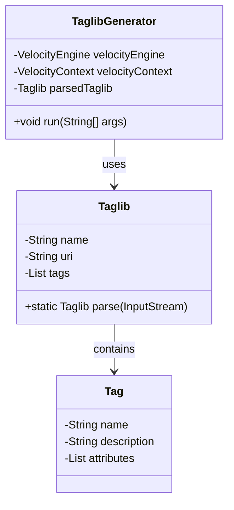

# Documentation du Module jsp2thymeleaf-tldgen

## 1. Vue d'Ensemble

Le module `jsp2thymeleaf-tldgen` est un générateur de code qui automatise la création de convertisseurs pour les bibliothèques de balises JSP personnalisées (TLD - Tag Library Descriptor). Son objectif principal est de faciliter l'extension du framework JSP2Thymeleaf en générant un projet Maven complet contenant des squelettes de convertisseurs pour une bibliothèque de balises JSP spécifique.

## 2. Architecture et Composants Principaux

### 2.1. Structure du Module

```
jsp2thymeleaf-tldgen/
├── src/
│   ├── main/
│   │   ├── java/
│   │   │   └── com/cybernostics/jsp2thymeleaf/toolkit/
│   │   │       ├── App.java                     # Point d'entrée Spring Boot
│   │   │       ├── TaglibGenerator.java         # Générateur principal des convertisseurs
│   │   │       ├── TaglibGeneratorOptions.java  # Options de ligne de commande
│   │   │       └── model/
│   │   │           └── Taglib.java              # Modèle représentant une TLD
│   │   └── resources/
│   │       ├── project/                         # Templates pour le projet généré
│   │       │   ├── pom.xml.vm                   # Template Velocity pour le POM
│   │       │   └── src/                         # Structure du projet généré
│   │       │       ├── main/
│   │       │       │   └── java/
│   │       │       │       └── package_name/
│   │       │       │           └── taglib_name_TldConverterRegistration.java.vm
│   │       │       └── test/
│   │       │           └── java/
│   │       │               └── package_name/
│   │       │                   └── taglib_name_TldConverterHappyCaseTest.java.vm
│   │       └── application.properties           # Configuration Spring Boot
│   └── test/                                    # Tests unitaires
└── pom.xml                                      # Configuration Maven
```

### 2.2. Diagramme d'Architecture

Pour une vue détaillée de l'architecture du module sous forme de diagramme UML, veuillez vous référer au fichier [ARCHITECTURE_UML.md](ARCHITECTURE_UML.md). Voici un aperçu du modèle de classes principal:



### 2.2. Composants Principaux

1. **TaglibGenerator**  
   Classe centrale qui gère le processus de génération. Il utilise Velocity pour appliquer les templates et créer les fichiers du projet de convertisseurs.

2. **Taglib**  
   Modèle qui représente une bibliothèque de balises JSP, avec des informations sur son nom, son URI, sa description et la liste des balises qu'elle contient.

3. **TaglibGeneratorOptions**  
   Gère les options de ligne de commande qui permettent de spécifier la TLD source et les paramètres de génération.

4. **Templates Velocity**  
   Les fichiers `.vm` qui définissent la structure et le contenu du projet généré.

## 3. Processus de Génération

Le processus de génération suit ces étapes:

1. **Analyse de la TLD**  
   Le générateur analyse le fichier TLD pour extraire:
   - Informations de base (nom, URI, description)
   - Liste des balises
   - Liste des attributs par balise
   - Liste des fonctions

2. **Préparation du Contexte**  
   Un contexte Velocity est créé avec toutes les informations nécessaires pour les templates.

3. **Génération du Projet**  
   Les templates sont appliqués pour générer:
   - Le fichier `pom.xml`
   - La classe d'enregistrement des convertisseurs
   - Les tests unitaires de base

4. **Création de la Structure du Projet**  
   Les fichiers générés sont écrits dans la structure de répertoires appropriée.

## 4. Types de Convertisseurs Générés

### 4.1. Convertisseurs de Balises (Tag Converters)

Pour chaque balise définie dans la TLD, le générateur crée un squelette de convertisseur qui:
- Mappe la balise JSP à un élément HTML approprié
- Transforme les attributs JSP en attributs Thymeleaf
- Configure la manipulation du contenu intérieur

### 4.2. Convertisseurs de Fonctions (Function Converters)

Pour les fonctions définies dans la TLD, le générateur crée des convertisseurs qui:
- Transforment les appels de fonctions JSP en expressions équivalentes Thymeleaf
- Permettent de modifier les noms et les arguments des fonctions

## 5. Guide d'Utilisation

### 5.1. Prérequis

- Java 8 ou supérieur
- Maven 3.x

### 5.2. Utilisation en Ligne de Commande

```bash
java -jar jsp2thymeleaf-tldgen.jar --tld=[chemin_vers_fichier_tld] --package=com.example.converters --output=[dossier_sortie]
```

#### Options Principales:

- `--tld`: Chemin vers le fichier TLD à analyser (obligatoire)
- `--package`: Package Java pour les classes générées (obligatoire)
- `--output`: Dossier où sera généré le projet (obligatoire)
- `--gav`: Coordonnées Maven pour un JAR contenant la TLD (format: groupe:artefact:version)

### 5.3. Exemple Complet

```bash
java -jar jsp2thymeleaf-tldgen.jar --tld=c:/tlds/mytags.tld --package=com.example.mytagsconverters --output=c:/projects/mytags-converters
```

## 6. Cycle de Vie d'un Projet Généré

1. **Génération**: Le projet est généré avec des squelettes de convertisseurs.
2. **Personnalisation**: Le développeur complète les convertisseurs générés.
3. **Tests**: Les tests unitaires vérifient le bon fonctionnement des convertisseurs.
4. **Intégration**: Le module généré s'intègre au framework JSP2Thymeleaf.

## 7. Structure du Projet Généré

```
jsp2thymeleaf-converters-[nom_taglib]/
├── src/
│   ├── main/
│   │   └── java/
│   │       └── [package]/
│   │           └── [nom_taglib]TldConverterRegistration.java  # Enregistrement des convertisseurs
│   └── test/
│       └── java/
│           └── [package]/
│               └── [nom_taglib]TldConverterHappyCaseTest.java  # Tests de base
└── pom.xml  # Définition du projet Maven
```

## 8. Exemple de Convertisseur Généré

Voici un exemple simplifié de classe d'enregistrement de convertisseurs générée:

```java
package com.example.mytagsconverters;

import com.cybernostics.jsp2thymeleaf.api.common.AvailableConverters;
import static com.cybernostics.jsp2thymeleaf.api.common.Namespaces.TH;
import static com.cybernostics.jsp2thymeleaf.api.common.Namespaces.XMLNS;
import com.cybernostics.jsp2thymeleaf.api.common.taglib.ConverterRegistration;
import static com.cybernostics.jsp2thymeleaf.api.elements.JspTagElementConverter.converterFor;
import com.cybernostics.jsp2thymeleaf.api.elements.TagConverterSource;

public class MytagsTldConverterRegistration implements ConverterRegistration {
    @Override
    public void run() {
        final TagConverterSource mytagsTaglibConverterSource = new TagConverterSource()
            .withConverters(
                /* Description de la balise */
                converterFor("myTag")
                    // Définition du convertisseur
                    .withNewName("div", XMLNS)
                    .addsAttributes(attributeNamed("text", TH)
                        .withValue("${value}")
                    ),
                    
                /* Description de la balise */
                converterFor("anotherTag")
                    // Définition du convertisseur
                    .withNewName("span", XMLNS)
            );

        AvailableConverters.addConverter("http://example.com/mytags", mytagsTaglibConverterSource);
    }
}
```

## 9. Intégration avec d'Autres Modules

Le module `jsp2thymeleaf-tldgen` s'intègre avec:

1. **jsp2thymeleaf-api**: Utilise les interfaces définies dans l'API pour créer des convertisseurs compatibles.
2. **jsp2thymeleaf**: Les projets générés dépendent du module principal pour les tests.

## 10. Limites et Contraintes

- Le générateur crée des squelettes qui nécessitent une personnalisation manuelle.
- Certaines fonctionnalités JSP avancées peuvent nécessiter des adaptations spécifiques.
- Le module ne prend pas en charge tous les cas particuliers de TLD.

## 11. Pistes d'Amélioration

1. **Support pour Plus de Types de Balises**:
   - Balises complexes avec corps dynamiques
   - Balises itératives
   - Balises de manipulation de variables

2. **Meilleure Analyse Sémantique**:
   - Analyse du comportement des balises pour proposer des convertisseurs plus précis
   - Extraction de la documentation pour ajouter des commentaires utiles

3. **Interface Utilisateur**:
   - Ajouter une interface Web pour la génération
   - Prévisualisation des convertisseurs générés

4. **Intégration IDE**:
   - Plugin pour Eclipse/IntelliJ
   - Assistant de personnalisation intégré
